# Tutorial: Como criar o primeiro projeto no Revit 2025 em diante (.NET 8.0)

Este guia demonstra o passo a passo para configurar e criar o seu primeiro plugin para o Revit (versões 2025 ou superiores), utilizando o Visual Studio e a plataforma .NET 8.0.

---

## 1. Criando o Projeto compatível com o Revit

1. Abra o **Visual Studio** e clique em **Create a new Project**.
   
   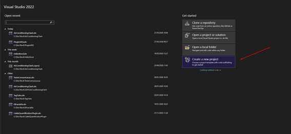

2. Na barra de pesquisa, procure por **Class Library**.
   * ⚠️ **Aviso:** Escolha a opção que diz *apenas* `Class Library`. Fuja da opção que tem ".NET Framework" no nome!

   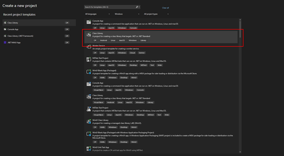

3. Escolha o **nome do seu projeto**, defina a **localização** no seu computador e clique em **Next**.

   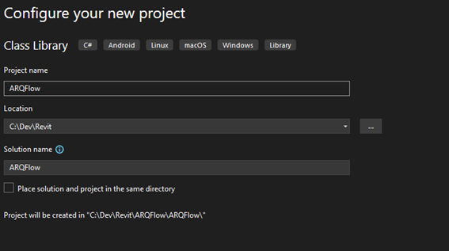

4. Na tela de informações adicionais, selecione o Framework **.NET 8.0 (Long Term Support)** e clique em **Create**.

   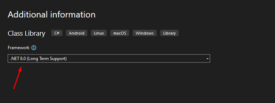

---

## 2. Configurando as Referências da API do Revit

Para que o seu código consiga interagir com o Revit, precisamos adicionar as bibliotecas da API.

1. No *Solution Explorer*, clique com o botão direito em **Dependencies** e selecione **Add Project Reference**.

   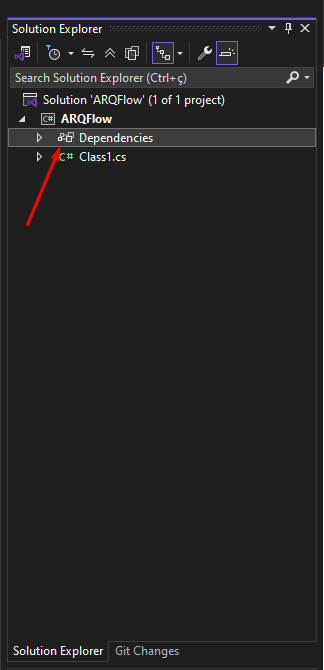
   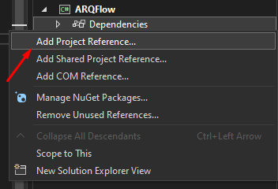

2. Na janela que se abrir, clique em **Browse** e navegue até a pasta de instalação do Revit: `C:\Program Files\Autodesk\Revit 2025`.
3. Selecione e adicione os arquivos `RevitAPI.dll` e `RevitAPIUI.dll`.

   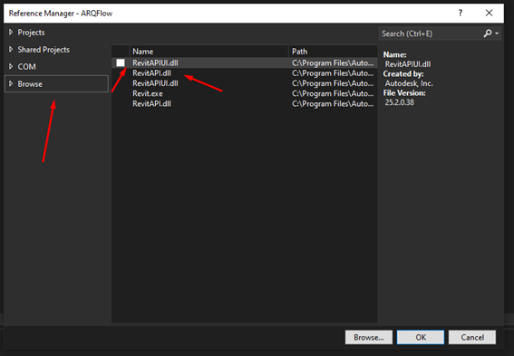

4. **Passo Crucial:** Selecione as duas referências recém-adicionadas, abra a janela de Propriedades (Properties) e mude a opção **Copy Local** para **No**.

   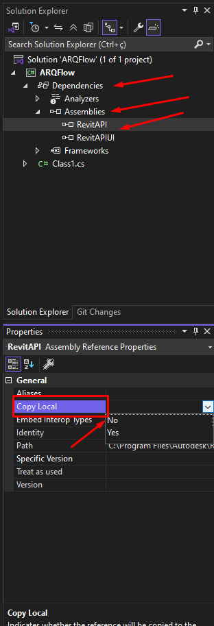

5. Agora, dê um duplo clique no nome do projeto no *Solution Explorer* para abrir o arquivo `.csproj`. Altere o bloco `<PropertyGroup>` para garantir que contenha as seguintes propriedades:

```xml
<PropertyGroup>
  <TargetFramework>net8.0-windows</TargetFramework>
  <UseWPF>true</UseWPF>
</PropertyGroup>
```

---

## 3. Configurando o Debug e Cópia Automática (Post-Build)

Vamos configurar o Visual Studio para iniciar o Revit automaticamente ao clicarmos em "Play" (F5) e copiar os arquivos do plugin para a pasta correta do Revit.

1. Clique com o botão direito no projeto e selecione **Properties**.

   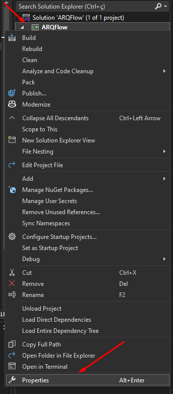

2. No menu lateral, vá em **Debug** > **General** e clique em **Open debug launch profiles UI**.

   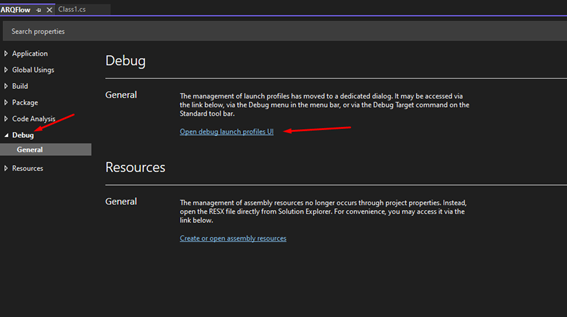

3. No canto superior esquerdo, crie um novo perfil clicando no ícone e escolhendo **Executable**.

   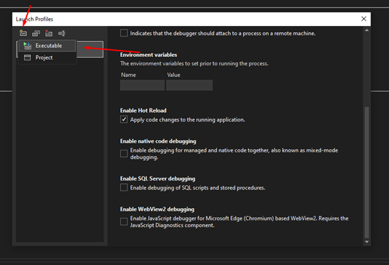

4. No campo *Executable*, aponte para o arquivo `Revit.exe` localizado em `C:\Program Files\Autodesk\Revit 2025`.

   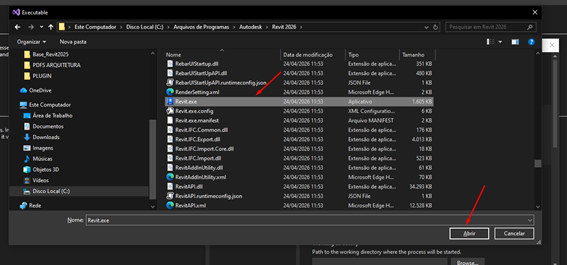

5. Renomeie este perfil para **REVIT**.

   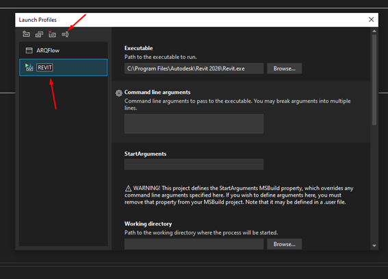

6. Feche essa janela e, na barra superior do Visual Studio, troque o botão de inicialização (botão verde) para o executável **REVIT** que você acabou de criar.

   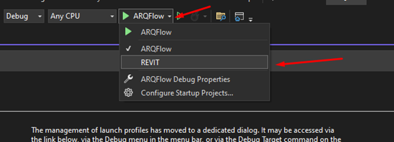

7. Voltando à janela de **Properties**, vá em **Build** > **Events** e cole o seguinte código no campo **Post-Build event**. Este script copia os arquivos automaticamente após compilar:

```bat
:: 1. Cria a pasta dedicada para o seu plugin se ela ainda não existir
if not exist "%AppData%\Autodesk\Revit\Addins\2025\ARQFlow" mkdir "%AppData%\Autodesk\Revit\Addins\2025\ARQFlow"

:: 2. Copia APENAS o arquivo .addin para a raiz do Revit
copy "$(TargetDir)ARQFlow.addin" "%AppData%\Autodesk\Revit\Addins\2025\" /Y

:: 3. Copia APENAS a .dll para dentro da pasta dedicada do ARQFlow
copy "$(TargetDir)ARQFlow.dll" "%AppData%\Autodesk\Revit\Addins\2025\ARQFlow\" /Y

:: 4. Copia a pasta de recursos inteira para dentro da pasta dedicada
xcopy "$(TargetDir)ResourcesARQFlow" "%AppData%\Autodesk\Revit\Addins\2025\ARQFlow\ResourcesARQFlow\" /Y /I /E
```
*Observação: Lembre-se de substituir "ARQFlow" pelo nome do seu projeto, caso seja diferente.*

   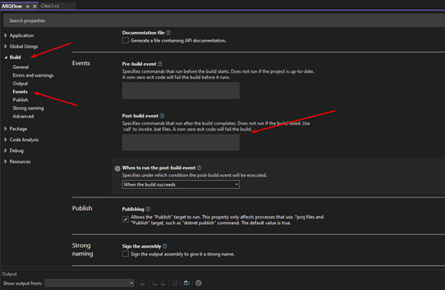

---

## 4. Criando o Código do Plugin "Hello World"

1. Renomeie o arquivo padrão `Class1.cs` para `App.cs`.
2. Substitua o conteúdo do arquivo `App.cs` pelo código abaixo (lembre-se de ajustar o `namespace` para o nome do seu projeto):

```csharp
   using System;
   using System.IO;
   using System.Reflection;
   using System.Windows.Media.Imaging;
   using Autodesk.Revit.UI;
   
   namespace ARQFlow
   {
       public class App : IExternalApplication
       {
           // Esse é o "ajudante" que coloca a imagem no botão
           private void SetIcon(PushButton button, string iconPath)
           {
               if (!File.Exists(iconPath))
                   return;
   
               var bitmap = new BitmapImage();
               bitmap.BeginInit();
               bitmap.UriSource = new Uri(iconPath, UriKind.Absolute);
               bitmap.CacheOption = BitmapCacheOption.OnLoad;
               bitmap.EndInit();
               bitmap.Freeze(); // Importante para não travar o arquivo no Windows
   
               button.LargeImage = bitmap; // Ícone grande (32x32)
               button.Image = bitmap;      // Ícone pequeno (16x16)
           }
   
           public Result OnStartup(UIControlledApplication application)
           {
               // 1. Cria uma aba personalizada
               string tabName = "ARQFlow";
               try
               {
                   application.CreateRibbonTab(tabName);
               }
               catch { /* Aba já existe */ }
   
               // 2. Cria um painel dentro da aba
               RibbonPanel panel = application.CreateRibbonPanel(tabName, "Ferramentas");
   
               // 3. Define os caminhos (Onde está a DLL e a pasta de ícones)
               string assemblyPath = Assembly.GetExecutingAssembly().Location;
               string dllFolder = Path.GetDirectoryName(assemblyPath);
   
               // 4. Configura os dados do botão
               PushButtonData buttonData = new PushButtonData(
                   "btnHelloWorld",
                   "Hello\nWorld",
                   assemblyPath,
                   "ARQFlow.Commands.Command"
               );
   
               // 5. ADICIONA O BOTÃO AO PAINEL
               // Note que guardamos o botão na variável 'myButton' para poder colocar o ícone depois
               PushButton myButton = panel.AddItem(buttonData) as PushButton;
   
               // 6. COLOCA O ÍCONE
               // Ele vai procurar na pasta: %AppData%\Autodesk\Revit\Addins\2025\ResourcesARQFlow\hello-word.ico
               string iconFullPath = Path.Combine(dllFolder, "ResourcesARQFlow", "hello-word.ico");
               SetIcon(myButton, iconFullPath);
   
               return Result.Succeeded;
           }
   
           public Result OnShutdown(UIControlledApplication application)
           {
               return Result.Succeeded;
           }
       }
   }
```

3. Crie uma pasta chamada **Commands** na raiz do projeto.

   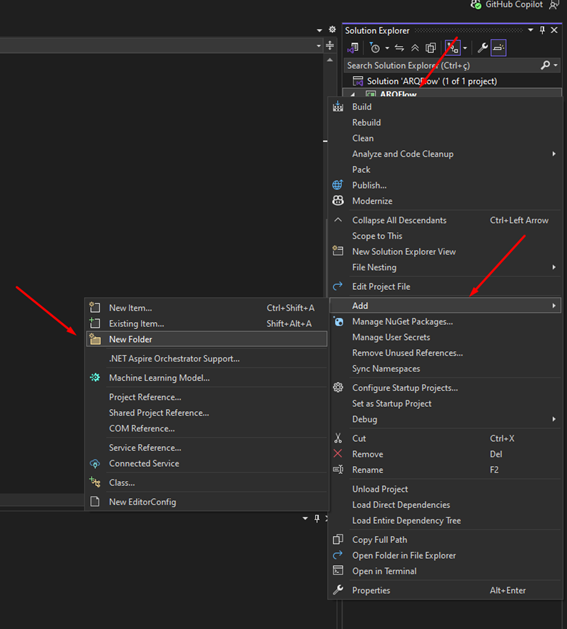

4. Dentro da pasta `Commands`, crie uma classe chamada `Command.cs` e cole o código abaixo:

```csharp
   using Autodesk.Revit.Attributes;
   using Autodesk.Revit.DB;
   using Autodesk.Revit.UI;
   
   namespace ARQFlow.Commands
   {
       [Transaction(TransactionMode.Manual)]
       public class Command : IExternalCommand
       {
           public Result Execute(ExternalCommandData commandData, ref string message, ElementSet elements)
           {
               TaskDialog.Show("ARQFlow", "Hello World! Comando executado da pasta Commands.");
               return Result.Succeeded;
           }
       }
   }
```

5. Crie uma pasta chamada **Resources** na raiz do projeto e coloque o seu arquivo de ícone (`hello-word.ico`) dentro dela. 
6. Selecione o ícone no *Solution Explorer*, vá nas Propriedades e altere **Copy to Output Directory** para **Copy if newer**.

   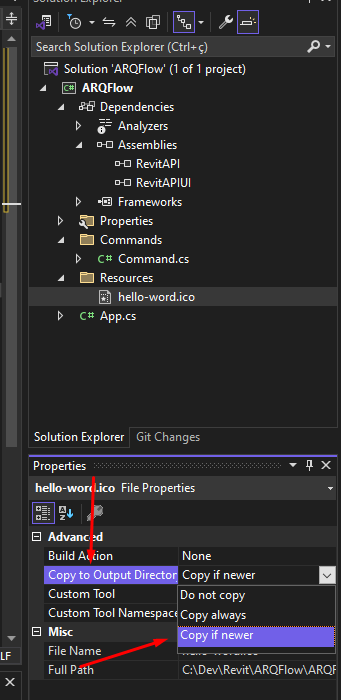

---

## 5. Criando o Manifesto (.addin)

O arquivo `.addin` é responsável por avisar ao Revit que o seu plugin existe.

1. Crie um arquivo texto na raiz do projeto com a extensão `.addin` (ex: `ARQFlow.addin`) e cole o template abaixo:

```xml
<?xml version="1.0" encoding="utf-8"?>
<RevitAddIns>
  <AddIn Type="Application">
    <Name>Nome do plugin</Name>
    <FullClassName>Nome do Plugin\Nome do plugin.App</FullClassName>
    <Assembly>Nome do plugin.dll</Assembly>
    <AddInId>Crie um novo id</AddInId>
    <VendorId>Seu nome</VendorId>
  </AddIn>
</RevitAddIns>
```

2. Altere as tags `<Name>`, `<FullClassName>`, `<Assembly>` e `<VendorId>` para as informações reais do seu projeto.
3. Para gerar a tag `<AddInId>`, vá no menu superior do Visual Studio em **Tools** > **Create GUID**.

   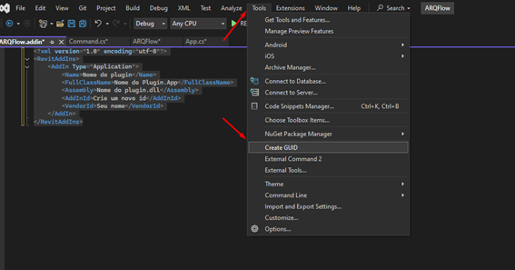

4. Escolha o formato **4. Formato de Registro**, clique em **Copiar** e cole o valor dentro da tag `<AddInId>`, **retirando as chaves `{ }`**.

   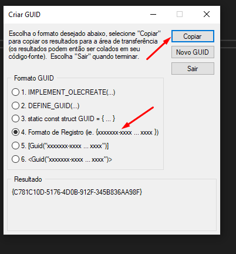
   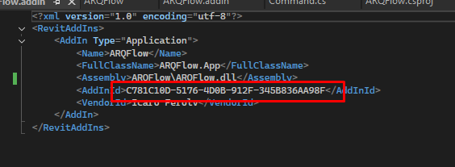

5. Selecione o arquivo `.addin` no *Solution Explorer* e, nas Propriedades, altere **Copy to Output Directory** para **Copy if newer**.

---

## 🎉 Testando o Plugin

Salve tudo e clique em **Build > Build Solution** (ou pressione F6). Em seguida, aperte **F5** (Start Debugging) para abrir o Revit automaticamente.

Se tudo estiver correto, o seu primeiro plugin aparecerá na Ribbon do Revit, pronto para uso!

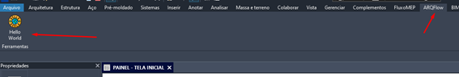
